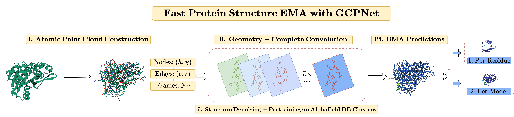

<div align="center">

# GCPNet-EMA

<a href="https://pytorch.org/get-started/locally/"></a>
<a href="https://pytorchlightning.ai/"></a>
<a href="https://hydra.cc/"></a>

<!-- [](https://www.nature.com/articles/nature14539)
[](https://papers.nips.cc/paper/2020) -->



</div>

## Description

Source code for the paper "Protein Structure Accuracy Estimation using Geometry-Complete Perceptron Networks".

## Contents

- [Installation](#installation)
- [GCPNet for protein structure EMA (GCPNet-EMA)](#gcpnet-for-protein-structure-ema-gcpnet-ema)
  - [How to prepare data for GCPNet-EMA](#how-to-prepare-data-for-gcpnet-ema)
  - [How to train GCPNet-EMA](#how-to-train-gcpnet-ema)
  - [How to evaluate GCPNet-EMA](#how-to-evaluate-gcpnet-ema)
  - [How to predict lDDT scores for new protein structures using GCPNet-EMA](#how-to-predict-lddt-scores-for-protein-structures-using-gcpnet-ema)
- [For developers](#for-developers)
- [Acknowledgements](#acknowledgements)
- [Citations](#citations)

## Installation

Install Mamba

```bash
wget "https://github.com/conda-forge/miniforge/releases/latest/download/Mambaforge-$(uname)-$(uname -m).sh"
bash Mambaforge-$(uname)-$(uname -m).sh  # accept all terms and install to the default location
rm Mambaforge-$(uname)-$(uname -m).sh  # (optionally) remove installer after using it
source ~/.bashrc  # alternatively, one can restart their shell session to achieve the same result
```

Install dependencies

```bash
# clone project
git clone https://github.com/BioinfoMachineLearning/GCPNet-EMA
cd GCPNet-EMA

# create conda environment
mamba env create -f environment.yaml
conda activate GCPNet-EMA  # NOTE: one still needs to use `conda` to (de)activate environments

# install local project as package
pip3 install -e .

# install ProDy separately to avoid a Biopython version conflict with Ankh
pip3 install prody==2.4.1
```

**Note**: TM-score is required to score predicted protein structures, where one can install it as follows:

```bash
# download and compile TM-score
mkdir -p ~/Programs && cd ~/Programs
wget https://zhanggroup.org/TM-score/TMscore.cpp
g++ -static -O3 -ffast-math -lm -o TMscore TMscore.cpp
rm TMscore.cpp
```

Make sure to update the `tmscore_exec_path` value in e.g., `configs/paths/default.yaml` to reflect where you have placed the TM-score executable on your machine. Also, make sure that `lddt_exec_path` points to the `bin/lddt` path within your `GCPNet-EMA` Conda environment, where `lddt` is installed automatically as described in `environment.yaml`.

## GCPNet for protein structure EMA (`GCPNet-EMA`)

### How to prepare data for `GCPNet-EMA`

Download training and evaluation data

```bash
cd data/EMA/
wget https://zenodo.org/record/8150859/files/ema_decoy_model.tar.gz
wget https://zenodo.org/record/8150859/files/ema_true_model.tar.gz
tar -xzf ema_decoy_model.tar.gz
tar -xzf ema_true_model.tar.gz
cd ../../  # head back to the root project directory
```

### How to train `GCPNet-EMA`

Train a model for the estimation of protein structure model accuracy (**EMA**) task

```bash
python3 src/train.py experiment=gcpnet_ema.yaml
```

### How to evaluate `GCPNet-EMA`

Reproduce our results for the EMA task

```bash
default_ema_model_ckpt_path="checkpoints/EMA/no_plddt_or_esm_emb_model.ckpt"
af2_ema_model_ckpt_path="checkpoints/EMA/no_esm_emb_model.ckpt"

python3 src/eval.py data=ema model=gcpnet_ema logger=csv trainer.accelerator=gpu trainer.devices=1 ckpt_path="$default_ema_model_ckpt_path"
python3 src/eval.py data=ema model=gcpnet_ema logger=csv trainer.accelerator=gpu trainer.devices=1 ckpt_path="$af2_ema_model_ckpt_path"
```

```bash
Default EMA Model - No AlphaFold plDDT or ESM Embeddings as Inputs
┏━━━━━━━━━━━━━━━━━━━━━━━━━━━━━━━━┳━━━━━━━━━━━━━━━━━━━━━━━━━━━━━━━━┓
┃          Test metric           ┃          DataLoader 0          ┃
┡━━━━━━━━━━━━━━━━━━━━━━━━━━━━━━━━╇━━━━━━━━━━━━━━━━━━━━━━━━━━━━━━━━┩
│        test/PerModelMAE        │      0.04611478000879288       │
│        test/PerModelMSE        │      0.004228705074638128      │
│  test/PerModelPearsonCorrCoef  │       0.8075723052024841       │
│       test/PerResidueMAE       │      0.07066802680492401       │
│       test/PerResidueMSE       │      0.010494622401893139      │
│ test/PerResiduePearsonCorrCoef │       0.7123321890830994       │
│           test/loss            │      0.005345446057617664      │
└────────────────────────────────┴────────────────────────────────┘

AlphaFold EMA Model - No ESM Embeddings as Inputs
┏━━━━━━━━━━━━━━━━━━━━━━━━━━━━━━━━┳━━━━━━━━━━━━━━━━━━━━━━━━━━━━━━━━┓
┃          Test metric           ┃          DataLoader 0          ┃
┡━━━━━━━━━━━━━━━━━━━━━━━━━━━━━━━━╇━━━━━━━━━━━━━━━━━━━━━━━━━━━━━━━━┩
│        test/PerModelMAE        │      0.042016904801130295      │
│        test/PerModelMSE        │      0.003771992400288582      │
│  test/PerModelPearsonCorrCoef  │       0.8381679654121399       │
│       test/PerResidueMAE       │      0.06481857597827911       │
│       test/PerResidueMSE       │      0.009247069247066975      │
│ test/PerResiduePearsonCorrCoef │       0.7482331991195679       │
│           test/loss            │      0.004621841479092836      │
└────────────────────────────────┴────────────────────────────────┘
```

### How to predict lDDT scores for protein structures using `GCPNet-EMA`

Predict per-residue and per-model lDDT scores for 3D protein structures

```bash
default_ema_model_ckpt_path="checkpoints/EMA/no_plddt_or_esm_emb_model.ckpt"
predict_batch_size=1  # adjust as desired according to available GPU memory
num_workers=0  # note: required when initially processing new PDB file inputs, due to ESM's GPU usage

python3 src/predict.py model=gcpnet_ema data=ema data.predict_input_dir=$MY_INPUT_PDB_DIR data.predict_true_dir=$MY_OPTIONAL_TRUE_PDB_DIR data.predict_output_dir=$MY_OUTPUTS_DIR data.predict_batch_size=$predict_batch_size data.num_workers=$num_workers logger=csv trainer.accelerator=gpu trainer.devices=1 ckpt_path="$default_ema_model_ckpt_path"
```

For example, one can predict per-residue and per-model lDDT scores for a batch of tertiary protein structure inputs, `6W6VE.pdb` and `6W77K.pdb` within `data/EMA/examples/decoy_model`, as follows

```bash
python3 src/predict.py model=gcpnet_ema data=ema data.predict_input_dir=data/EMA/examples/decoy_model data.predict_output_dir=data/EMA/examples/outputs data.predict_batch_size=1 data.num_workers=0 data.python_exec_path="$HOME"/mambaforge/envs/gcpnet/bin/python data.lddt_exec_path="$HOME"/mambaforge/envs/gcpnet/bin/lddt data.pdbtools_dir="$HOME"/mambaforge/envs/gcpnet/lib/python3.10/site-packages/pdbtools/ logger=csv trainer.accelerator=gpu trainer.devices=[0] ckpt_path=checkpoints/EMA/model.ckpt
```

**Note**: After running the above command, an output CSV containing metadata for the predictions will be located at `logs/predict/runs/YYYY-MM-DD_HH-MM-SS/predict_YYYYMMDD_HHMMSS_rank_0_predictions.csv`, with text substitutions for the time at which the above command was completed. This CSV will contain a column called `predicted_annotated_pdb_filepath` that identifies the temporary location of each input PDB file after annotating it with GCPNet-EMA's predicted lDDT scores for each residue. If a directory containing ground-truth PDB files corresponding one-to-one with the inputs in `data.predict_input_dir` is provided as `data.predict_true_dir`, then metrics and PDB annotation filepaths will also be reported in the output CSV to quantitatively and qualitatively describe how well GCPNet-EMA was able to improve upon AlphaFold's initial per-residue plDDT values.

## For developers

Set up `pre-commit` (one time only) for automatic code linting and formatting upon each `git commit`

```bash
pre-commit install
```

Manually reformat all files in the project, as desired

```bash
pre-commit run -a
```

Update dependencies in `environment.yml`

```bash
mamba env export > env.yaml # e.g., run this after installing new dependencies locally
diff environment.yaml env.yaml # note the differences and copy accepted changes back into `environment.yaml`
rm env.yaml # clean up temporary environment file
```

Use `Gunicorn` to parallelize responses to web server requests across `4` workers using port `5000`

```bash
gunicorn -w 4 -b 0.0.0.0:5000 --timeout 300 src.wsgi:app
```

Test server locally using `curl`

```bash
curl -X POST -F "title=6KHVA" -F "structure_upload=@data/EMA/test_examples/decoy_model/6KHVA.pdb" -F "results_email=username@email.com" http://localhost:5000/server_predict
```

**NOTE**: Make sure to create in the project's local directory (i.e., `./`) a `.env` file that contains values for four key environment variables for server support: (1) `SERVER_EMAIL_ADDRESS` (e.g., "bml@missouri.edu"); (2) `SERVER_EMAIL_SMTP_SERVER` (e.g., "massmail.missouri.edu"); (3) `SERVER_EMAIL_PORT` (e.g., "587" by default); and (4) `SERVER_SECRET_KEY` (initially generated by the Python `secrets` package).

## Acknowledgements

GCPNet-EMA builds upon the source code and data from the following project(s):

- [EnQA](https://github.com/BioinfoMachineLearning/EnQA)
- [GCPNet](https://github.com/BioinfoMachineLearning/GCPNet)
- [lightning-hydra-template](https://github.com/ashleve/lightning-hydra-template)
- [ProteinWorkshop](https://github.com/a-r-j/ProteinWorkshop)

We thank all their contributors and maintainers!

## Citing this work

If you use the code or data associated with this project, or otherwise find this work useful, please cite:

```bibtex
@article{morehead2023gcpnet_ema,
  title={Protein Structure Accuracy Estimation using Geometry-Complete Perceptron Networks},
  author={Morehead, Alex and Cheng, Jianlin},
  year={2023}
}
```
